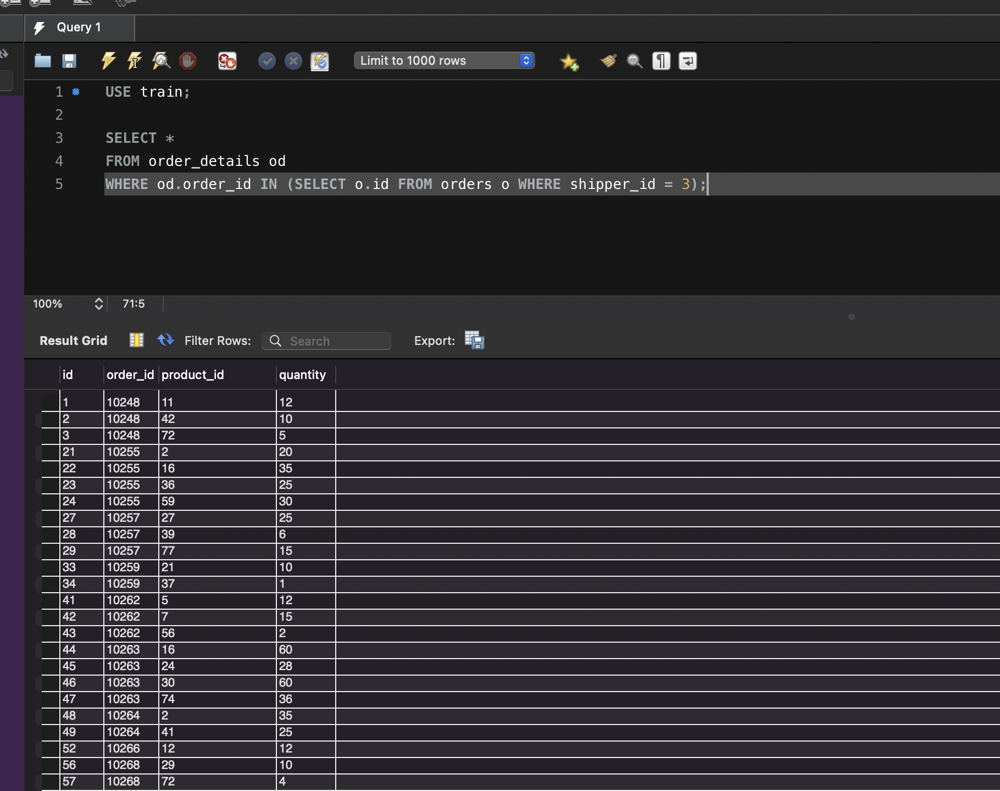
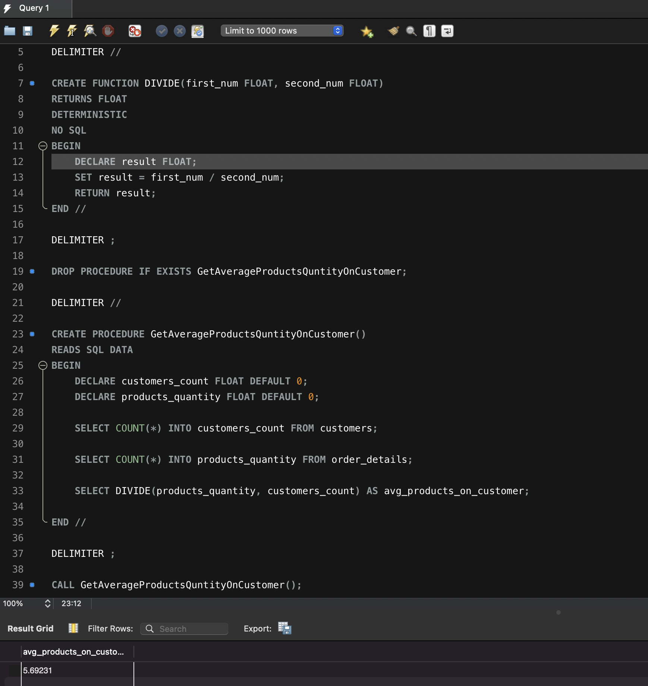

# Домашнє завдання до Теми 5. Вкладені запити. Повторне використання коду

### Результат виконаного ДЗ

В КОЖНОМУ ЗАПИТІ НА ПОЧАТКУ ВКАЗАНА СХЕМА З ЯКОЮ ПРАЦЮЄ ЗАПИТ 
```js
USE train;
```

1. Напишіть SQL запит, який буде відображати таблицю order_details та поле customer_id з таблиці orders відповідно для кожного поля запису з таблиці order_details. Це має бути зроблено за допомогою вкладеного запиту в операторі SELECT.
```js
SELECT *, (SELECT customer_id FROM orders o WHERE od.order_id = o.id) AS customer_id FROM order_details od
FROM order_details od
```


2. Напишіть SQL запит, який буде відображати таблицю order_details. Відфільтруйте результати так, щоб відповідний запис із таблиці orders виконував умову shipper_id=3. Це має бути зроблено за допомогою вкладеного запиту в операторі WHERE.
```js
SELECT * 
FROM order_details od
WHERE od.order_id IN (SELECT o.id FROM orders o WHERE shipper_id = 3);
);
```


3. Напишіть SQL запит, вкладений в операторі FROM, який буде обирати рядки з умовою quantity>10 з таблиці order_details. Для отриманих даних знайдіть середнє значення поля quantity — групувати слід за order_id.
```js
SELECT order_id, AVG(quantity) as avg_quantity
FROM (SELECT * FROM order_details od WHERE od.quantity > 10) AS temp_scheme
GROUP BY order_id;
```


4. Розв’яжіть завдання 3, використовуючи оператор WITH для створення тимчасової таблиці temp. Якщо ваша версія MySQL більш рання, ніж 8.0, створіть цей запит за аналогією до того, як це зроблено в конспекті.
```js
WITH temp_scheme AS (
SELECT *
FROM order_details od 
WHERE od.quantity > 10)
SELECT order_id, AVG(quantity) as avg_quantity
FROM temp_scheme
GROUP BY order_id;
```


5. Створіть функцію з двома параметрами, яка буде ділити перший параметр на другий. Обидва параметри та значення, що повертається, повинні мати тип FLOAT.Використайте конструкцію DROP FUNCTION IF EXISTS. Застосуйте функцію до атрибута quantity таблиці order_details .
```js
DROP FUNCTION IF EXISTS DIVIDE;

DELIMITER //

CREATE FUNCTION DIVIDE(first_num FLOAT, second_num FLOAT)
RETURNS FLOAT
DETERMINISTIC
NO SQL
BEGIN
	DECLARE result FLOAT;
	SET result = first_num / second_num;
	RETURN result;
END //

DELIMITER ;

DROP PROCEDURE IF EXISTS GetAverageProductsQuntityOnCustomer;

DELIMITER //

CREATE PROCEDURE GetAverageProductsQuntityOnCustomer()
READS SQL DATA
BEGIN
	DECLARE customers_count FLOAT DEFAULT 0;
    DECLARE products_quantity FLOAT DEFAULT 0;
    
    SELECT COUNT(*) INTO customers_count FROM customers;
    
    SELECT COUNT(*) INTO products_quantity FROM order_details;
    
    SELECT DIVIDE(products_quantity, customers_count) AS avg_products_on_customer;
    
END //

DELIMITER ;

CALL GetAverageProductsQuntityOnCustomer();
```
